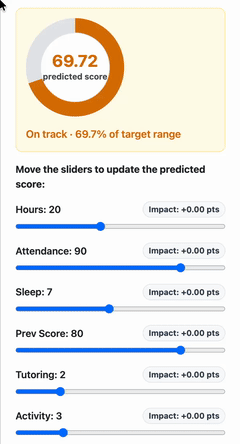

# Student Performance Factors: A Multivariate Machine Learning Analysis 🎓

**[View the Interactive Project & Score Predictor Here](https://migue-rc.github.io/student-performance/)**

## Executive Summary
This project explores the determinants of academic success using a multivariate machine learning approach. By analyzing the "Student Performance Factors" dataset, this analysis moves beyond simple academic metrics to incorporate family, socioeconomic, and behavioral variables. 

The ultimate objective of this research is to segment student profiles and accurately predict final evaluation scores, providing a data-driven framework for educational institutions to transition from reactive interventions to proactive, targeted support strategies.

## Key Insights & Results
* **Predictive Performance:** A Linear Regression model emerged as the most robust predictor of academic success, achieving an $R^2 \approx 0.825$ and a Mean Absolute Error (MAE) of $0.41$ points on the test set.
* **The Power of Engineered Features:** Composite metrics created during feature engineering, such as *Study Intensity* (study hours weighted by attendance percentage) and *Study-Sleep Balance*, proved to be highly indicative of student outcomes.
* **Behavioral Segmentation:** Utilizing K-Means clustering and Principal Component Analysis (PCA), the student body was successfully segmented into distinct behavioral archetypes, offering clear mappings for tailored academic programs.

## Methodology
The analysis follows a comprehensive, end-to-end analytical lifecycle:

1. **Data Preparation & Feature Engineering:** * Addressed missing values (< 2%) via mode imputation to preserve central tendencies without introducing statistical bias.
   * Engineered new proxy variables to capture the nuance of effective academic engagement.
2. **Exploratory Data Analysis (EDA):** * Conducted univariate and bivariate analysis to map variable distributions.
   * Retained valid outliers identified via the IQR method to preserve high-variance scenarios.
   * Analyzed correlation matrices to verify the absence of disruptive multicollinearity.
3. **Supervised Modeling:** * Built a robust preprocessing pipeline using `StandardScaler` and `OneHotEncoder`.
   * Benchmarked multiple algorithms including Linear Regression, Random Forest, Gradient Boosting, SVM, and KNN.
4. **Unsupervised Learning:** * Applied dimensionality reduction and clustering algorithms to discover latent patterns in student study habits and physical activity levels.

## Technologies Used
* **Data Manipulation & Processing:** `pandas`, `numpy`
* **Machine Learning:** `scikit-learn` (Regression pipelines, K-Means clustering, PCA, Cross-validation)
* **Interactive Visualization:** `plotly`

## Project Architecture
The full analysis is documented and structurally divided into the following sections:
* `01_data_preparation.html`: Data loading, cleaning strategies, and feature engineering rationale.
* `02_eda.html`: Distribution visualizations, outlier handling, and correlation mapping.
* `03_modeling.html`: Algorithm benchmarking, model evaluation, and cluster visualization.
* `04_conclusions.html`: Final reflections and strategic implications for educators.

---
**Author:** [miguebarbell](https://github.com/miguebarbell)